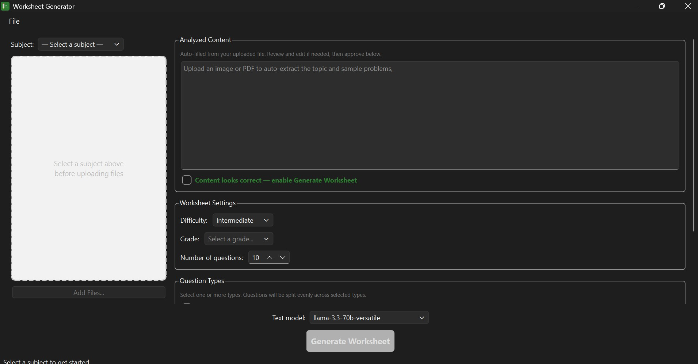

# Math Worksheet Generator

A desktop application that uses Groq AI to analyse math images or PDFs and generate
printable student worksheets with a matching teacher answer key.

---

## Requirements

| Requirement | Version |
|---|---|
| Python | 3.11 or later |
| Operating System | Windows 10 / 11 |
| Groq API key | Free tier sufficient — [console.groq.com](https://console.groq.com) |

---

## Running from Source

### 1. Clone / download the project

```
git clone <repo-url>
cd WorksheetApp
```

### 2. Install dependencies

```powershell
pip install -r requirements.txt
```

### 3. Add your Groq API key

Open `config\config.json` and paste your key:

```json
{
    "groq_api_key": "gsk_..."
}
```

Or set it at runtime via **File → Settings** once the app is open.

### 4. Run the app

```powershell
python main.py
# or
.\scripts\run.ps1
```

---

## First-Time Setup (New PC)

Run this **once** on any new machine before using the app or building:

```powershell
.\scripts\setup.ps1
```

What it does for you:
- Checks that Python 3.9+ is installed and shows the download link if not
- Upgrades pip
- Installs all packages from `requirements.txt`
- Installs PyInstaller
- Verifies every import works and reports a clear pass/fail summary

> Tip: you can also right-click `scripts\setup.ps1` and choose **Run with PowerShell**.

---

## Building a Standalone Executable

The build script handles everything — dependency installation, PyInstaller setup,
and bundling — in one step.

### Quick build (recommended — folder bundle, fastest startup)

```powershell
.\scripts\build_exe.ps1
```

Output: `dist\WorksheetGenerator\WorksheetGenerator.exe`

### Single-file build (one portable .exe, slightly slower cold start)

```powershell
.\scripts\build_exe.ps1 -OneFile
```

Output: `dist\WorksheetGenerator.exe`

### Force a clean rebuild

```powershell
.\scripts\build_exe.ps1 -Clean
# or combined
.\scripts\build_exe.ps1 -Clean -OneFile
```

### What the script does

1. Verifies Python is available in PATH
2. Installs all packages from `requirements.txt`
3. Installs PyInstaller if not already present
4. Removes previous build artifacts
5. Runs PyInstaller with the correct flags for all dependencies
   (`pdfplumber`, `pdfminer`, `pypdfium2`, `PyQt6`, `openai`, `fpdf2`)
6. Reports the output path and file size

### Running the executable

**Folder bundle:**
```
dist\WorksheetGenerator\WorksheetGenerator.exe
```

**Single file:**
```
dist\WorksheetGenerator.exe
```

> The `config\config.json` is bundled as a default. Any settings changed via
> **File → Settings** inside the app are saved separately in the user's app-data
> folder and take precedence over the bundled defaults.

---

## Usage

1. **Add files** — click **Add Files…** or drag and drop images (`.jpg`, `.png`) or
   text-based PDFs (`.pdf`) onto the panel.
2. **Analyze** — click **Analyze Files**. The app extracts content and summarises it
   into a structured topic description.
3. **Review** — edit the topic description in the right panel if needed.
4. **Configure** — choose difficulty and number of questions.
5. **Generate** — click **Generate Worksheet**. Two PDFs are saved to the output folder:
   - `worksheet_student_<timestamp>.pdf`
   - `worksheet_teacher_<timestamp>.pdf`

### Supported input types

| Type | Notes |
|---|---|
| JPEG / PNG images | Analysed by Groq vision model |
| Selectable-text PDF | Text extracted by pdfplumber, then summarised |
| Scanned / image-only PDF | Not supported — export pages as images instead |

> Do not mix images and PDFs in the same session. Upload one type at a time.

---

## Project Structure

```
WorksheetApp/
├── main.py                  # Entry point
├── requirements.txt
├── config/
│   └── config.json          # Default settings (API key, models, defaults)
├── scripts/
│   ├── build_exe.ps1        # Build standalone executable
│   └── run.ps1              # Run from source
├── services/
│   ├── ai_service.py        # Groq API calls (vision extraction, summarisation, Q generation)
│   └── worksheet_service.py # QThread workers
├── ui/
│   ├── image_panel.py       # File upload panel (images + PDFs)
│   ├── main_window.py       # Main application window
│   ├── options_panel.py     # Topic, difficulty, output settings
│   ├── progress_dialog.py   # Generation progress overlay
│   └── settings_dialog.py   # API key and model settings
└── utils/
    ├── config_manager.py    # Reads and writes config.json
    ├── logger.py            # Logging setup
    ├── pdf_generator.py     # Builds student and teacher PDFs via fpdf2
    └── pdf_reader.py        # Extracts text from selectable-text PDFs
```

---

## AI Models Used

| Purpose | Default model |
|---|---|
| Image content extraction | `meta-llama/llama-4-scout-17b-16e-instruct` |
| Topic summarisation & Q generation | `llama-3.3-70b-versatile` |

Both models are configurable via **File → Settings**.

---

## Security Note

**Never commit your `config\config.json` with a real API key to a public repository.**
Add it to `.gitignore`:

```
config/config.json
```

## Screenshot

